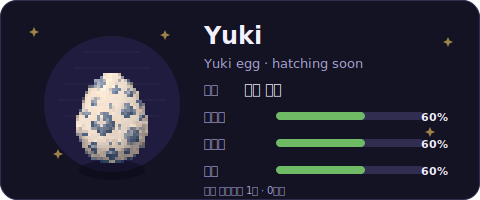

# 🐣 Commitchi

**English** · [한국어](./README.ko.md)

A Tamagotchi-style pet that lives in your GitHub profile README and feeds on your commits.

Each owner can name their own individual pet and choose which registered character to
raise. Changing the configured character switches the active pet in your roster: the
previous pet freezes where it was, and switching back resumes it. The default is **Yuki**,
an original snowy-owl pixel sprite.

- **Commit** and your pet gets full and happy.
- **Go quiet** and your pet gets hungry, then sick.
- Collaborative work raises your pet's **happiness**, while steady commit rhythm raises
  **stamina**.
- **Disappear for 4+ days by default** and your pet fades into that character's ghost form — who returns the moment you commit again.
- Your pet also **grows up** over time: egg → baby → child → teen → adult.
- Raised characters fill your personal dex progress as they reach later stages.
- The pet card shows dex progress as raised characters / total catalog characters.
- Evolution and 7/30/100-day streak milestones trigger a one-tick **celebration**
  badge and sparkle effect.

A GitHub Action ticks on a schedule, regenerates `pet.svg` and `dex.svg`, and commits them back so your README always shows the current pet and collection progress.

## Growth stages

Stages advance purely with age:

| Stage | Age |
|---|---|
| egg | day 0 |
| baby | day 1+ |
| child | day 3+ |
| teen | day 7+ |
| adult | day 14+ |

Moods (`happy` / `hungry` / `sick`) are driven by fullness, happiness, stamina,
and how recently you committed. Each stage has its own mood sprite. Neglect
(4+ days with no contributions by default) shows the active character's ghost
variant.

> The character system is **data-driven** (a registry over `catalog.json` + per-character `character.json`), so new characters can be added as data. Config-based character selection is available today; coding-pattern-based species selection (`pickSpecies`) stays parked for later special/limited character rules.

## How it works

```
GitHub Actions (scheduled)
  → fetch your contribution activity (GraphQL)
  → update pet-state.json   (roster memory: active pet, stats, stage, milestones, dex)
  → render pet.svg + dex.svg (SVGs + matching pixel sprites, embedded as base64 PNGs)
  → commit pet.svg + dex.svg + pet-state.json back to the repo
README embeds pet.svg + dex.svg
```

The sprite is embedded into the SVG as a base64 data URI on purpose — relative/external image references inside an SVG don't survive GitHub's image proxy, but a self-contained SVG renders reliably.

## Setup

Add `.github/workflows/commitchi.yml` to your profile repository
(`<your-username>/<your-username>`):

```yaml
name: commitchi

on:
  schedule:
    - cron: "0 */6 * * *"
  workflow_dispatch: {}

permissions: { contents: write }

concurrency:
  group: commitchi-pet-state
  cancel-in-progress: false

jobs:
  commitchi:
    runs-on: ubuntu-latest
    steps:
      - uses: actions/checkout@v4
      - uses: vanilalatte03/commitchi@v1
        # with: { github-token: ${{ secrets.PET_TOKEN }} }  # To count private contributions too.
```

Then embed the pet in your profile `README.md`:

```md


```

Run the workflow once from the **Actions** tab (`workflow_dispatch`) to create
your first `pet.svg`, `dex.svg`, and `pet-state.json`. After that, the schedule
updates the pet automatically. You do not need to copy this repository's source
into your profile repo; when the `@v1` tag moves, your workflow uses the latest
v1 engine.
The dex gallery is generated alongside the pet and shows collection progress for
the full catalog; uncollected entries appear as silhouettes with `???`.

To let visitors feed or play with your pet by opening an issue, add
`.github/workflows/commitchi-visitor.yml` too:

```yaml
name: commitchi-visitor

on:
  issues:
    types: [opened]

permissions: { contents: write, issues: write }

concurrency:
  group: commitchi-pet-state
  cancel-in-progress: false

jobs:
  visitor:
    runs-on: ubuntu-latest
    steps:
      - uses: actions/checkout@v4
      - uses: vanilalatte03/commitchi@v1
        with: { mode: visitor }
```

Add issue links like these to your README so visitors can trigger the workflow:
[🍖 Feed](https://github.com/<owner>/<repo>/issues/new?title=commitchi%3A%20feed)
/ [🎾 Play](https://github.com/<owner>/<repo>/issues/new?title=commitchi%3A%20play).
Commitchi only responds to issue titles exactly `commitchi: feed` or
`commitchi: play`.

Optional config lives at `commitchi.config.json` in your profile repo. If the file
is missing, Commitchi uses the built-in defaults, including Yuki as the default
character.

```json
{
  "petName": "Mochi",
  "language": "ko",
  "displayStage": "auto",
  "theme": "dark",
  "economy": {
    "feedPerContrib": 12,
    "decayPerDay": 22
  }
}
```

## Run locally

```bash
npm install
npm run demo      # DEMO mode: sample data → writes pet.svg + dex.svg + pet-state.json
npm run visitor   # issue-op mode: reads ISSUE_TITLE + ISSUE_AUTHOR, updates the pet if recognized
npm run preview   # renders every stage + mood (+ ghost) to ./preview/*.svg
```

With real data:

```powershell
$env:GH_USERNAME = "your-username"   # PowerShell
$env:GH_TOKEN    = "ghp_xxx"         # a token with read:user
npm run build; npm run tick
```

## Configuration

Create `commitchi.config.json` at the repo root when you want to customize the defaults:

```json
{
  "petName": "Mochi",
  "language": "ko",
  "theme": "dark",
  "economy": {
    "feedPerContrib": 12,
    "decayPerDay": 22,
    "happinessDecayPerDay": 8,
    "staminaDecayPerDay": 8,
    "startFullness": 60
  },
  "thresholds": {
    "hungryFullness": 45,
    "sickFullness": 15,
    "neglectDays": 4
  }
}
```

`petName` is the user-chosen name shown at the top of the card.
The name comes from `petName` in `commitchi.config.json`; editing `name` directly in `pet-state.json` is overwritten by the config value on the next tick.
`character` chooses the active registered character to raise. Changing it switches to
that character's roster pet: an existing pet resumes from its frozen state, while a
newly chosen character starts as an egg. Inactive pets do not decay, and your personal
dex records how far each character has been raised. Pick any character id listed in
`catalog.json`.
`language` switches **all** card text and visitor comments between fully Korean (`"ko"`)
and fully English (`"en"`) — no mixing. It defaults to `"ko"`.
`displayStage` can pin the card to show a reached stage sprite, or `"auto"` to
follow the pet's real stage. This is cosmetic only: age, stats, evolution, and
neglect continue to simulate normally. A pinned stage is used only when it is at
or below that character's personal dex `maxStage`; locked stages are ignored and
the real stage is shown instead. If the active pet is a ghost, the pin is ignored
and the ghost form is shown.
Only the `dark` theme exists today; the field is there so more card themes can be added without changing the config shape.

| Knob | Meaning | Default |
|---|---|---|
| `petName` | displayed individual pet name; legacy `name` is still accepted | `Mochi` |
| `character` | active registered character; changing it switches roster pets | Yuki |
| `language` | card + comment language: `"ko"` (fully Korean) or `"en"` (fully English) | `ko` |
| `displayStage` | stage sprite to pin on the card; `"auto"` follows the real stage | `auto` |
| `economy.feedPerContrib` | fullness gained per new contribution | 12 |
| `economy.decayPerDay` | fullness lost per day with no feeding | 22 |
| `economy.happinessDecayPerDay` | happiness lost per elapsed day | 8 |
| `economy.staminaDecayPerDay` | stamina lost per elapsed day | 8 |
| `economy.startFullness` | newborn starting value for fullness, happiness, and stamina | 60 |
| `thresholds.hungryFullness` | stat level at/below which the pet becomes hungry | 45 |
| `thresholds.sickFullness` | stat level at/below which the pet becomes sick | 15 |
| `thresholds.neglectDays` | days without contributions before the active pet becomes a ghost | 4 |

The config file is optional and partial overrides are supported. For example, `{ "petName": "Bori" }` only changes the displayed pet name.

## Project layout

```
src/
  config.ts     optional commitchi.config.json loader + validation
  index.ts      orchestrates a tick
  visitor.ts    issue-op visitor feeding/play CLI
  github.ts     GraphQL fetch → contribution activity
  state.ts      load / update / save pet-state.json  (stats + economy)
  evolution.ts  stage progression + neglect → ghost variant
  characters.ts data-driven character registry: loads + validates catalog.json
                and each assets/sprites/<id>/character.json
  sprites.ts    maps stage/mood → the right pixel sprite (per character), embeds as base64
  render.ts     pet.svg card assembly (sprite, bob animation, celebration effects)
  render-dex.ts dex.svg collection gallery assembly
  i18n.ts       Korean / English bundles for generic UI text (character names come
                from character.json)
  preview.ts    dev-only gallery generator
  types.ts      shared types
catalog.json                 dex registry: dex number → character id
assets/sprites/<id>/character.json  per-character manifest (id, displayName, ghostName, author, license)
assets/sprites/<id>/         the pixel sprites (PNG) + character.json
action.yml                   reusable composite action for scheduled ticks
.github/workflows/character-validation.yml character catalog validation
.github/workflows/release.yml  builds dist/ and force-moves the @v1 tag on merge to main
```

> `pet-state.json` does not need to exist before the first run. Commitchi creates the
> roster and active pet, then commits the generated `pet.svg`, `dex.svg`, and `pet-state.json` into
> your profile repo. Keep that `pet-state.json` when updating Commitchi so roster and dex
> progress do not restart.

## License

- Source code: [MIT](./LICENSE)
- Character/sprite art: [CC BY 4.0](./LICENSE-ASSETS.md)

Want to add your own character? See [CONTRIBUTING.md](./CONTRIBUTING.md).
